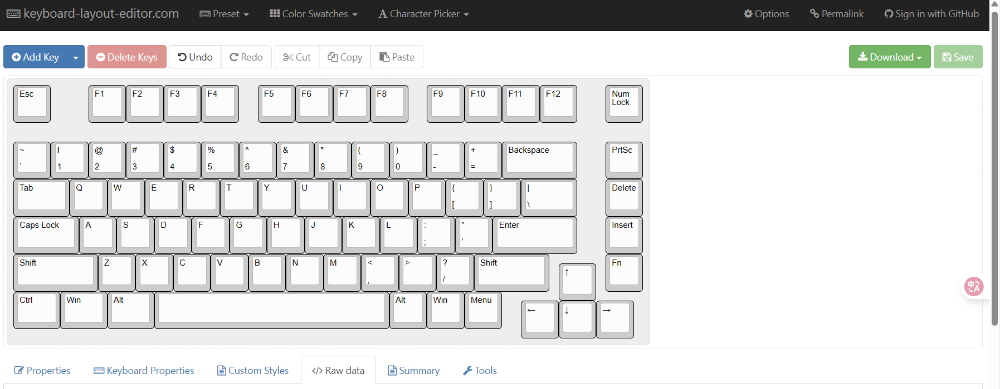
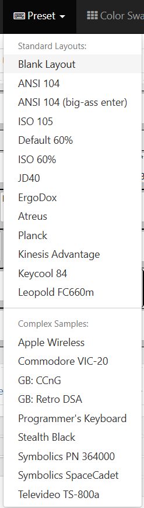
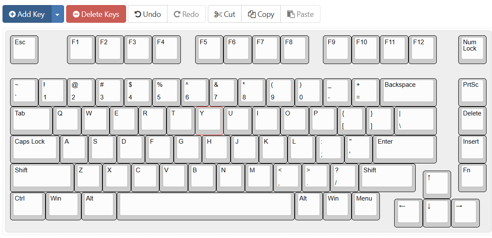
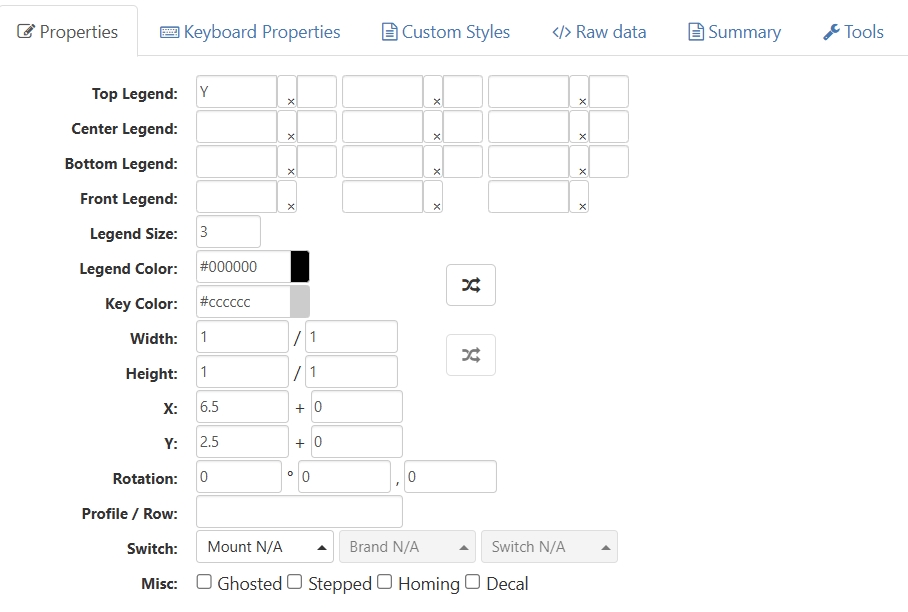
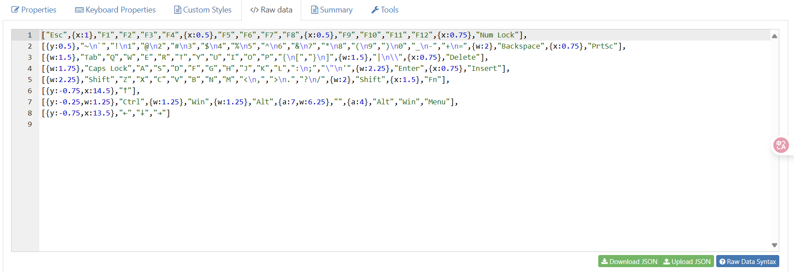
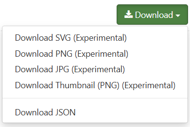

<h1>客制化键盘 -- 主键盘部分</h1>

    

    	
    

    

    	Copyright Statement
    

    

    	本文档/代码/作品受版权保护，版权所有@EternoPax。保留所有权利。
    

    

        未经允许请勿转载 
        Do not reproduce without permission
    

    

        联系我👉EternoPax@outlook.con
    

    

        
            @Copyright EternoPax
        
        
    

> 作为一个客制化键盘的主键盘,在这里我将介绍我的学习过程,希望一起学习

### 基础介绍

### 键盘布局

> [Keyboard Layout Editor](https://www.keyboard-layout-editor.com/?ref=producthunt#/)

这是通过网站设计的键盘布局,虽然这个网站的功能很多,当实际上用不到,笔者就简单介绍一下个人常用的几个功能.

在PreSet里面是我们常见的键盘布局,个人比较喜欢在ANSI104全键盘的基础上进行删减.

在当你选中其中的一个按键,上边的DeleteKeys会亮起,你可以直接使用Delete进行删除,也可以左键选中按下Delete一起删除(注意:选中会出现一个框,只有完全在框里的按键会被选中)

选中按键后可以按下方向键来调整位置

在

在Raw data里面是我们键盘的布局格式,这个是我们以后用来绘制CAD的数据

在右上角可以看到Download,请你再绘制好之后务必下载JSON和SVG,其中JSON是为了方便以后再进行layout的修改,而SVG是为了之后的键帽设计做准备.

### 原理图绘制

### PCB绘制

### 键帽设计

### 3D外壳

### 固件编写

### 最终成果